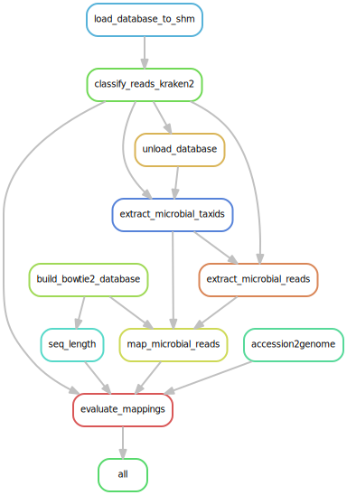
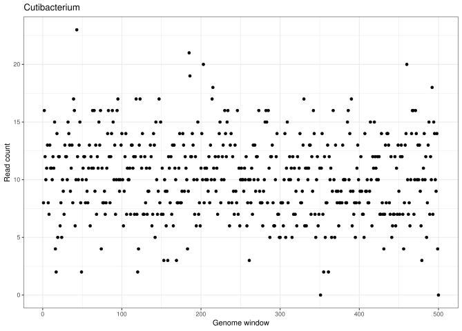
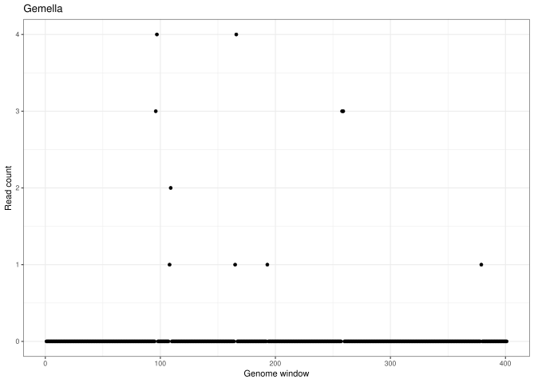
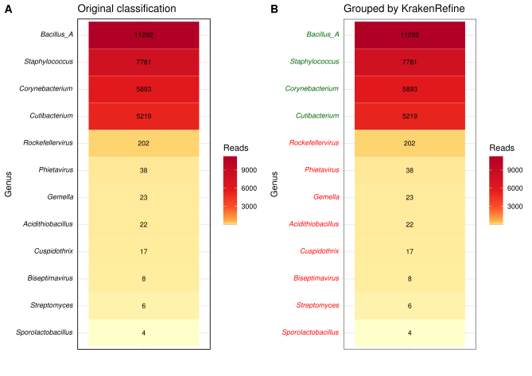

# README
KrakenRefine
=====
A Snakemake pipeline that takes **Kraken** (Kraken2) results and **Refine** them by aligning a subset of reads of particular interest with Bowtie2 to a set of reference genomes. The presence of a particular group of species (natively grouped at genus level, but this can be changed), is then evaluated based on coverage profiles, because many false positives origin from database genome contamination that lead to anomalies in coverage profiles.  

Snakemake Pipeline
=====
[Snakemake](https://github.com/snakemake/snakemake) is a workflow management step that allows for reproducible data analysis and a high degree of job parallelisation. This pipeline takes as input: 
* A Kraken2 database
* A set of reads
* A folder with the genomes used to build the Kraken2 database
* An SQL database from [FlexTaxD](https://github.com/FOI-Bioinformatics/flextaxd) generated when building your custom Kraken2 database

The pipeline is customised by specifying the paths to these inputs in the **config.yaml** file. 

*Rulegraph for Snakemake pipeline*

Example use case: Pathogen identification!
=====
The pipeline was developed to proces Nanopore metagenomic data from human plasma samples, with the aim of increasing the specificity for pathogen identification. 

The underlying idea came from the observation that reads from simulated datasets classified as species known to be absent, largely map to a limited region of the target genome. While Kraken2 has implemented the feature from KrakenUniq to report counts of [unique minimizers](https://dx.doi.org/10.1186/s13059-018-1568-0) with the `--report-minimizer-data` flag, this seems only to account for these false positives when coverage is higher than what is the case in pathogen identification. An example of a genera that is not filtered by even strict criteria for unique minimizer count is *Gemella*, which - compared to *Cutibacterium* known to be present in the test dataset - has an uneven coverage suggesting database genome contamination.

  

    
  

  

    
  

Based on the pattern exemplified above, **KrakenRefine** groups each genera as either a true positive or a false positive. The grouping is based on a ratio of 1) the number of reads in the genome window with the most reads and 2) the sum of reads mapping to the genome. The output from the pipeline is a heatmap as shown below with groupings, where green genera are true positives and red genera are false positives:

