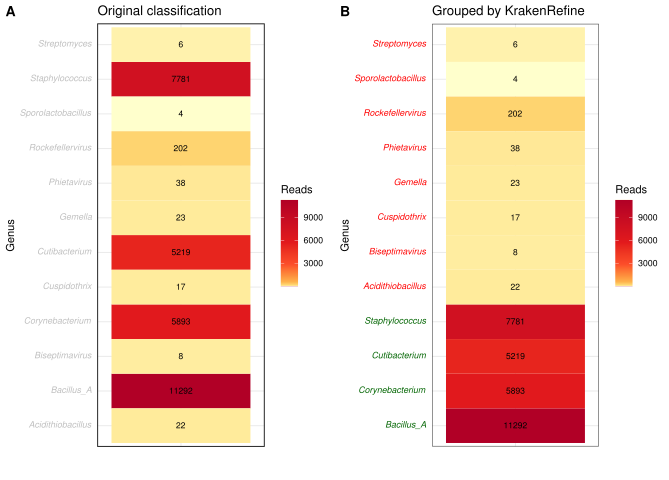

# README
KrakenRefine
=====
A Snakemake pipeline that takes **Kraken** (Kraken2) results and **Refine** them by aligning a subset of reads of particular interest with Bowtie2 to a set of reference genomes. The presence of a particular group of species (natively grouped at genus level, but this can be changed), is then evaluated based on coverage profiles, because many false positives origin from database genome contamination that lead to anomalies in coverage profiles.  

Snakemake Pipeline
=====
[Snakemake](https://github.com/snakemake/snakemake) is a workflow management step that allows for reproducible data analysis and a high degree of job parallelisation. This pipeline takes as input: 
* A Kraken2 database
* A set of reads
* A folder with the genomes used to build the Kraken2 database
* An SQL database from [FlexTaxD](https://github.com/FOI-Bioinformatics/flextaxd) generated when building your custom Kraken2 database

The pipeline is customised by specifying the paths to these inputs in the **config.yaml** file. 

*Rulegraph for Snakemake pipeline*

Example use case
=====

It was developed to reeva
pipeline to proces kraken2 data to remove false positives by mapping reads to reference genomes
This is a test